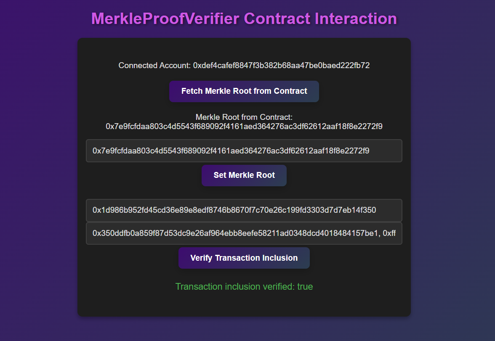

# Merkle Proof Verifier DApp

This project is a decentralized application (DApp) built with React and Web3.js that allows users to interact with a smart contract for verifying Merkle proofs. Users can connect their MetaMask wallet to the DApp, retrieve the Merkle root, set a new Merkle root, and verify transaction inclusion within the Merkle tree both manually on the client side and via the smart contract.

## Features

- **Connect MetaMask**: Enables users to connect their MetaMask wallet to the DApp.
- **Fetch Merkle Root**: Fetches the current Merkle root from the smart contract.
- **Set Merkle Root**: Allows authorized users to set a new Merkle root on the smart contract.
- **Transaction Inclusion Verification**: Verifies the inclusion of a transaction in the Merkle tree either manually in the frontend or via the smart contract.

## Project Structure

- **Frontend**: Built with React and Web3.js, the frontend enables user interactions with the smart contract.
- **Smart Contract**: A Solidity contract deployed on the Ethereum blockchain that stores the Merkle root and provides a verification function.
- **Manual Verification**: A local JavaScript function performs manual Merkle proof verification in the frontend.

## Getting Started

### Prerequisites

- [Node.js](https://nodejs.org/en/) (v14 or later)
- [MetaMask](https://metamask.io/) extension installed in your browser
- Ethereum test network (e.g., Goerli) for contract deployment and testing

### Installation

1. **Clone the repository**:
    ```bash
    git clone https://github.com/yourusername/merkle-proof-verifier.git
    cd merkle-proof-verifier
    ```

2. **Install dependencies**:
    ```bash
    npm install
    ```

3. **Configure the Contract Address and ABI**:
   In `App.js`, replace the contract address and ABI with those of your deployed smart contract.

4. **Run the DApp**:
    ```bash
    npm start
    ```

5. **Open the App**:
   Open your browser and go to `http://localhost:3000`.

### Smart Contract

This project uses a Solidity smart contract with the following main functions:

- `setMerkleRoot(bytes32 _merkleRoot)`: Allows the contract owner to set a new Merkle root.
- `merkleRoot()`: Returns the current Merkle root stored in the contract.
- `verifyTransactionInclusion(bytes32 transactionHash, bytes32[] memory proof)`: Verifies if a transaction hash is part of the Merkle tree using the provided proof.

### React Frontend

The frontend is built with React and provides the following main functionalities:

- **Connect to MetaMask**: Allows users to connect their MetaMask wallet.
- **Fetch Merkle Root**: Fetches the Merkle root from the contract.
- **Set Merkle Root**: Enables setting a new Merkle root (if authorized).
- **Verify Transaction Inclusion**: Verifies if a transaction is part of the Merkle tree by checking with the contract and manual verification in the frontend.

## How to Use

1. **Connect MetaMask**: Click the "Connect to MetaMask" button and authorize the connection.
2. **Fetch Merkle Root**: Click "Fetch Merkle Root from Contract" to retrieve the current Merkle root.
3. **Set Merkle Root**: Enter a new Merkle root and click "Set Merkle Root" (only accessible to the contract owner).
4. **Verify Transaction Inclusion**:
   - Enter the transaction hash and the proof (comma-separated) for verification.
   - Click "Verify Transaction Inclusion" to check inclusion.
   - The verification result will be displayed below the form.

### Manual Merkle Proof Verification

The frontend includes a manual verification function, `verifyMerkleProof`, which checks if a given transaction hash is part of the Merkle tree using the proof. This function hashes the transaction hash with each proof element and compares the final result to the Merkle root.

## Examples

### Example 1: Fetching the Merkle Root

Once the DApp is running, click on the **"Fetch Merkle Root from Contract"** button to retrieve the current Merkle root stored on the contract. This value is displayed in the interface.

### Example 2: Setting a New Merkle Root

If you are the contract owner, enter a new Merkle root in the input field and click **"Set Merkle Root"**. This will update the Merkle root stored on the smart contract.

### Example 3: Verifying Transaction Inclusion

To verify whether a transaction is part of the Merkle tree, you can use the following example data:

- **Transaction Hash**:
    ```
    0xff25d5a5579ba5a54d447b5ac014939911c02e26a4c52be56b1b8dceb3d11c06
    ```

- **Proof Array**:
    ```
    0x4e644d03a31e9dd080aaa1869d608e11683046c7769652541e99aee106d4b1e6,
    0x754ef0c0b5e09d3578093248a6a8fac69c8bfd24b6a8314794b851b85a18b910,
    0xb981523bbcc911764d10413dd55cdf89ce96c6737c53d1464f02ee1e60c8e1e1,
    0xe0f612d4513ed502f81749d0e3a472b313b6dea9d17cb48c82110ee280047520
    ```

- After entering the **Transaction Hash** and **Proof Array**, click on **"Verify Transaction Inclusion"**. The DApp will display whether the transaction is verified as part of the Merkle tree.

## Screenshots

### DApp Interface


## Technologies Used

- **Solidity**: For the smart contract on the Ethereum blockchain.
- **React**: For building the frontend interface.
- **Web3.js**: To interact with the Ethereum blockchain from the frontend.
- **MetaMask**: For wallet connection and user authentication.

## License

This project is licensed under the MIT License. See the [LICENSE](LICENSE) file for more details.

## Acknowledgments

- Ethereum community for extensive documentation and support.
- Inspiration from Merkle Tree and Proof-of-Inclusion concepts.
- [Web3.js Documentation](https://web3js.readthedocs.io/en/v1.7.1/)

---

**Note**: This DApp is currently configured to run on Ethereum test networks only. To use it on the mainnet, ensure you have enough ETH for transactions and use caution with sensitive data and wallet security.
